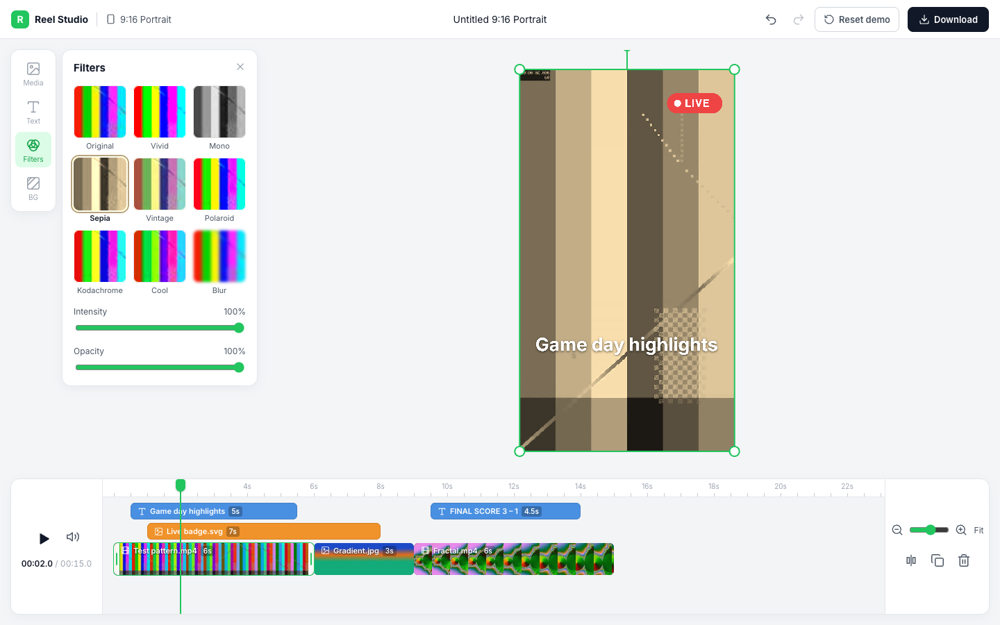

# Reel Studio

A canvas-based editor for short vertical social videos, built with **Angular, NgRx, RxJS and PixiJS**.

It covers the core loop of a social video editor: layered media and text on a WebGL canvas, a multi-track timeline, and full undo/redo.



## Features

**Canvas (PixiJS, WebGL)**
- Video, image and text layers on a 1080×1920 frame that scales to fit any screen.
- Select, drag, scale and rotate with an on-canvas transform box.
- Snapping to the frame centre with guides, and 15° rotation snapping (hold Shift to force it).
- GPU filters per clip, with adjustable intensity and opacity.
- Export the current frame as a full-resolution PNG.

**Timeline**
- Multiple tracks: text, overlays and a main video track. The top track renders on top.
- Drag clips in time and between compatible tracks. Trim either edge.
- Video trims respect the source media, so you cannot trim past the start or end of the file.
- Edges snap to the playhead, to 0, and to every other clip edge.
- Split at the playhead, duplicate and delete, from the context menu, the toolbar or the keyboard.
- Filmstrip thumbnails, a scrubbable ruler, zoom with slider, buttons, Fit, or Ctrl/⌘ + wheel around the pointer.

**Editing**
- Undo and redo for every project change. A drag, a slider move or a typing session is one step.
- Upload your own video and image files, or drop them on the media panel.
- Autosave to local storage.
- Light and dark themes, and a responsive layout down to phone width.

## Architecture

```
            ┌────────────── NgRx Store ───────────────┐
            │ project: History<Project>  (undoable)   │
            │ media:   asset library                  │
            │ ui:      selection, zoom, open panel    │
            └───────▲──────────────────────┬──────────┘
         actions    │                      │ selectors
   ┌────────────────┴───┐        ┌─────────┴────────────────────────┐
   │ Angular components │        │ StageRenderer (PixiJS)           │
   │ timeline, panels,  │        │ reconciles clips → display objs  │
   │ keyboard shortcuts │        │ render loop, video sync, gizmo   │
   └────────▲───────────┘        └─────────▲────────────────────────┘
            │      signals                 │
            └────── PlaybackService ───────┘
                  (time, playing, muted)
```

### One source of truth, Pixi as a view

The project lives in the NgRx store as plain, serialisable data: tracks, clips, transforms, text styles and filter settings. PixiJS never owns state. `StageRenderer` subscribes to the project and reconciles it into display objects.

Reducers are immutable, so a clip whose object reference has not changed is skipped. Editing one clip touches one display object. Changing only a filter's intensity updates the existing shader uniform instead of rebuilding the filter.

### Undo and redo as a meta-reducer

`undoable()` wraps the project reducer with `past / present / future` stacks.

- **Gestures coalesce.** Actions can carry a `gestureId`. All updates in one drag, slider move or typing session share an id and become one history entry.
- **No-op changes are not recorded.** The reducer returns the same reference when nothing changes, so a click without movement never creates an undo step.
- **Cheap snapshots.** Structural sharing keeps each snapshot cheap. History is capped at 100 entries.
- **UI state is excluded.** Selection, zoom and panels live outside history, so undo never changes what you are looking at.

### Playback outside change detection

Playback time changes 60 times a second, so it lives in Angular signals in `PlaybackService`, not in the store.

- **The render loop owns the clock.** Pixi's ticker advances time and keeps each `<video>` element in sync. It corrects drift above 250 ms and pre-rolls clips that start within the next second.
- **Only the playhead and the time label update** in Angular while playing. The app runs zoneless.
- **Render on demand.** Pixi's automatic per-frame render is removed. The loop renders only when something changed or a video is playing, so an idle editor uses almost no GPU.

### RxJS where streams fit

- **Pointer gestures** on the canvas and timeline are `pointermove` streams, throttled to one update per animation frame with `auditTime(0, animationFrameScheduler)` and ended with `takeUntil(pointerup)`.
- **Timeline drags start only after a 3px threshold**, using `skipWhile`.
- **Effects** import files in parallel with `mergeMap` and autosave with `debounceTime`.
- **Resize handling** wraps `ResizeObserver` in an Observable.

## Keyboard shortcuts

| Action | Keys |
| --- | --- |
| Play / pause | Space |
| Split clip at playhead | S |
| Duplicate | ⌘/Ctrl + D |
| Delete | Delete or Backspace |
| Undo / redo | ⌘/Ctrl + Z, ⌘/Ctrl + Shift + Z |
| Nudge selected clip | Arrow keys, Shift for 10× |
| Step playhead (nothing selected) | ← / →, Shift for 1 s |
| Timeline zoom | + / −, or ⌘/Ctrl + wheel |
| Edit text | Double-click text on the canvas or timeline |

## Project structure

```
src/app/
  core/       models, id and time helpers, clip factory
  state/      actions, project reducer, undo meta-reducer, selectors, effects
  services/   playback clock, media metadata and thumbnails, editor commands
  editor/
    stage/    PixiJS renderer and filter presets
    timeline/ timeline, clip blocks, context menu
    panels/   media, text, filters, background
  ui/         icon component and platform helpers
```

Each component lives in its own folder with its template and styles, for example `editor/top-bar/top-bar.ts`, `top-bar.html` and `top-bar.scss`. The root `App` component stays in `src/app`, next to `app.config.ts`.

## Running locally

Requires Node 22 or newer.

```bash
npm install
npm start          # http://localhost:4200
npm test           # reducer and undo/redo unit tests (Vitest)
npm run build      # production build in dist/reel-editor/browser
```

The sample media in `public/media` was generated with ffmpeg, so the repo contains no third-party footage.

## Next steps

- **Real-time co-editing.** The project is already plain data changed by actions. That maps well onto a CRDT such as Yjs: clips become a shared map and gestures become transactions. The local undo stack would then track only the current user's changes.
- **Video export.** Render frames offscreen with Pixi and encode them with WebCodecs, or send the project JSON to a server-side renderer.
- **Transitions and keyframes.** Add per-clip animation tracks for position, scale and opacity, interpolated in the render loop.
- **Audio.** Add a dedicated audio track with waveforms rendered from Web Audio.
